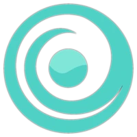

<div align="center">
    
    <h1>Lenstats</h1>
    <strong>View stats about you Lens  🌿 Comunity and reward them</strong>
</div>

This app uses [Lens Protocol](https://docs.lens.xyz/docs) 🌿.


## 🤝 Contributing

You can contribute to lenstats! Please check out the [Contributing guide](CONTRIBUTING.md) for guidelines about how to proceed.

## ⚙️ Running this project

You can run this project by following these steps:

1. Clone the repo, change into the directory, and install the dependencies

```sh
npm install

# or

yarn
```

2. Run the project

```sh
npm run dev
```

3. Open the project in your browser at [localhost:3000](http://localhost:3000/)

## ⚖️ License

This project is open-sourced software under the © [MIT](LICENSE).
